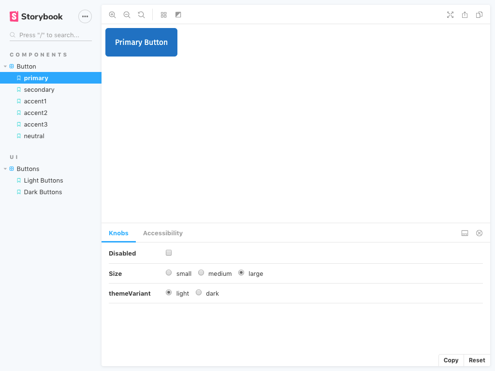
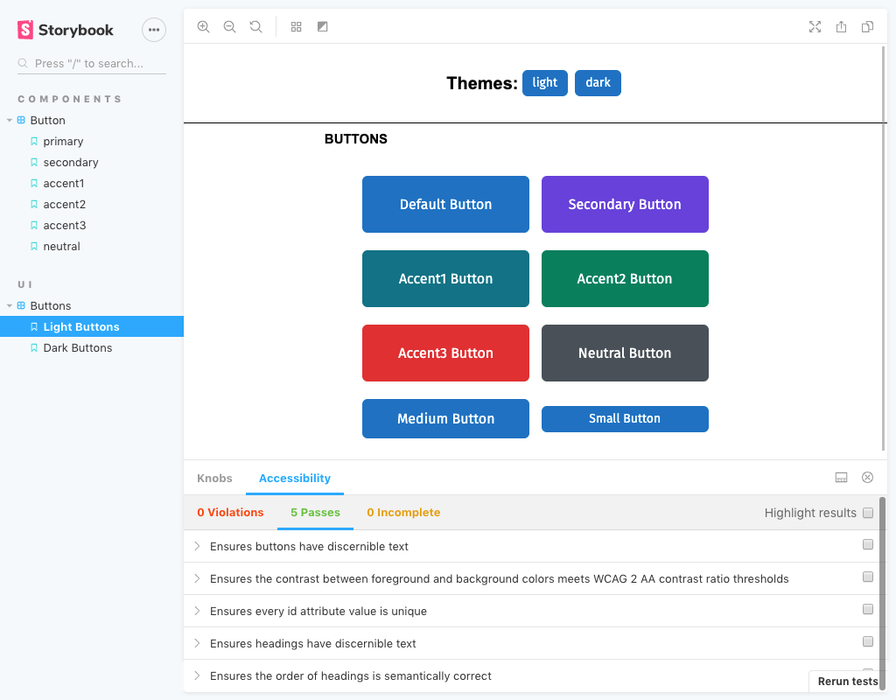
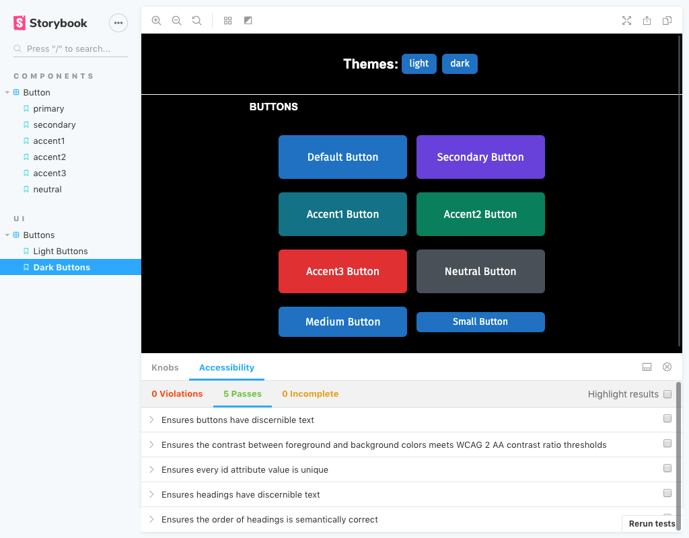

# React Styled Buttons

<p align="center">
  <a href="https://www.npmjs.com/package/@marinda/react-styled-buttons" target="_blank">
    
  <a href="LICENSE.md" target="_blank">
    
  </a>
  <a href="https://www.npmjs.com/package/@marinda/react-styled-buttons" target="_blank">
    
  </a>
  <a href="https://marinda.me/react-styled-buttons/?path=/story/components-button--primary" target="_blank">
    
  </a>
</p>


React button components with WCAG 2 AA contrast ratio tested colors, light and dark theme options. Flexible & easily customized.

Theme colors are [Open Colors](https://github.com/yeun/open-color). Buttons contrast between foreground and background colors meets WCAG 2 AA contrast ratio thresholds.

## Getting Started

Install.

```sh
npm i -S @marinda/react-styled-buttons
```

Import the Button component into your app:

```js
import { Button } from '@marinda/react-styled-buttons';
```

Add Button to your render function.

```js
<Button>Click Me!</Button>
```

## Demo
Explore all the button themes, styles and sizes in the [Storybook](https://marinda.me/react-styled-buttons/?path=/story/components-button--primary).





## Button props

These are the available props for the button component.

### as

Allows you to overwrite the element - by default it is rendered as a button element. This is useful if you need to use a routing Link component

```js
<Button as={Link} to="/about">
  About
</Button>
```

### any html attribute

Any html attribute can be passed as a prop and will be set as an attribute to the element.

```js
<Button tabindex="-1">
  About
</Button>
```

### onClick or any react on event handler

```js
<Button
onClick={() => {
    /* your click handler */
}}
onMouseUp={() => {
    /* your mouse up handler */
}}
>
```

### themeName

Name of the the color theme. Options: light(default), dark.

```js
<Button themeName="dark">
  About
</Button>
```

### variant

Button variant - this will assign different theme styles for each variant. Options: primary(default), secondary, accent1, accent2, accent3, neutral.

```js
<Button variant="secondary">
  About
</Button>
```

### size

Three sizes: large(default), medium, small.

```js
<Button size="small">
  About
</Button>
```

### theme

Theme object: a list of colors to be used for all the button variants. This object should match the shape of a [theme](https://github.com/mariiinda/react-styled-buttons/blob/master/src/theme/light.js).

```js
<Button theme={yourCustomThemeObject}>
  About
</Button>
```

##  Styles

### Compose your own styles
 If you are using [emotion](https://emotion.sh/), you can merge your own styles with existing styles ([composition](https://emotion.sh/docs/composition)) by passing in a [css prop](https://emotion.sh/docs/css-prop).

```js
<Button
css={css`
    background: red;
    &:hover {
    background: green;
    }
`}
>
About
</Button>
```